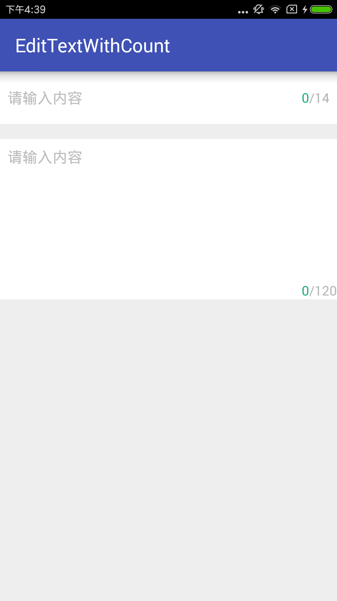

## EditTextWithCount

[](https://jitpack.io/#andyNinty/EditTextWithCount)

开发中经常用到的一个控件



### 使用方法

在xml文件中

```xml
<cn.andyleeblog.lib.EditTextWithCount
        android:layout_width="match_parent"
        android:layout_height="56dp"
        android:background="@android:color/white"
        app:hintText="请输入内容"
        app:maxCount="14" />
```

### 设置最大字符数

```java
editTextWithCount.setMaxCount(int maxCount);
```

### 设置行数

```java
editTextWithCount.setLines(int maxCount);
```

### 设置最大行数

```java
editTextWithCount.setMaxLines(int maxCount);
```

### 设置字体颜色

```java
editTextWithCount.setTextColor(int color);
```

### 设置hint 以及 颜色

```java
editTextWithCount.setHintText(String hint);
editTextWithCount.setHintTextColor(int color);
```

### 设置方向

```java
editTextWithCount.setViewOrientation(int orientation);
```

## 用法

在根目录下的 build.gradle 文件中添加

```groovy
allprojects {
		repositories {
			...
			maven { url 'https://jitpack.io' }
		}
	}
```

然后在app目录下的build.gradle文件中添加

```groovy
	dependencies {
	        compile 'com.github.andyNinty:EditTextWithCount:1.0'
	}
```
